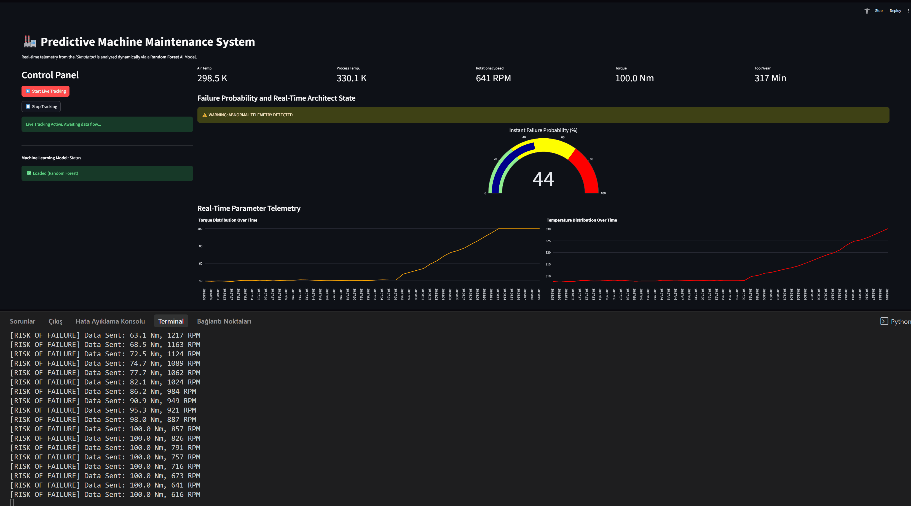

# 🏭 AI-Powered Predictive Maintenance Platform for Smart Manufacturing

<p align="center">
  
</p>


An AI-powered predictive maintenance platform that simulates real-time industrial machine telemetry and predicts equipment failures using Machine Learning. The project demonstrates how AI can be applied in Industry 4.0 manufacturing environments to improve equipment reliability, reduce downtime, and support data-driven maintenance decisions.

---

## 📖 Overview

Modern manufacturing facilities rely on continuous monitoring of equipment health to maximize productivity and minimize unexpected failures.

This project simulates real-time machine sensor data—including rotational speed, torque, air temperature, process temperature, and tool wear—and processes it through a Machine Learning pipeline to estimate the probability of equipment failure.

The system combines data simulation, feature engineering, machine learning inference, and interactive visualization to demonstrate an end-to-end predictive maintenance workflow for industrial environments.

---

## ✨ Key Features

- 🤖 Machine Learning-based equipment failure prediction
- 📊 Real-time industrial telemetry simulation
- 📈 Interactive monitoring dashboard using Streamlit
- 📉 Live visualization of machine health metrics
- ⚙️ Automated feature preprocessing pipeline
- 📦 Modular project architecture
- 💾 Serialized ML model using Joblib
- 🔄 Continuous real-time inference
- 📊 Industrial sensor data analysis

---

## 🏭 Industry Applications

This solution can be applied to:

- Automotive Manufacturing
- Smart Factories
- CNC Machines
- Industrial Robotics
- Assembly Lines
- Production Equipment Monitoring
- Preventive & Predictive Maintenance
- Manufacturing Quality Improvement
- Equipment Health Monitoring

---

# 🛠 Tech Stack

### Programming

- Python

### Machine Learning

- Scikit-learn
- Random Forest Classifier
- StandardScaler
- OneHotEncoder

### Data Processing

- Pandas
- NumPy
- Joblib

### Visualization

- Streamlit
- Plotly

### Development

- Git
- GitHub

---

# 📂 Project Architecture

```
                 AI4I 2020 Dataset
                        │
                        ▼
              Data Preprocessing
                        │
                        ▼
            Feature Engineering
                        │
                        ▼
         Random Forest Model Training
                        │
                        ▼
             Trained Model (.joblib)
                        │
                        ▼
         Real-Time Telemetry Simulator
                        │
                        ▼
           JSON Sensor Data Pipeline
                        │
                        ▼
            Machine Learning Inference
                        │
                        ▼
         Streamlit Monitoring Dashboard
                        │
                        ▼
      Equipment Failure Probability
```

---

# 📊 Machine Learning Pipeline

The predictive model is trained using the **AI4I 2020 Predictive Maintenance Dataset**.

### Data Preprocessing

- Removed identifier columns to prevent target leakage
- Encoded categorical machine types
- Standardized numerical features
- Balanced class distribution using class weights

### Features Used

- Air Temperature
- Process Temperature
- Rotational Speed
- Torque
- Tool Wear
- Machine Type

---

# 🤖 Model Selection

Multiple classification algorithms were evaluated.

| Algorithm           | Observation                                         |
| ------------------- | --------------------------------------------------- |
| Logistic Regression | Lower performance on nonlinear sensor relationships |
| Random Forest       | Best balance between accuracy and generalization    |
| XGBoost             | High performance but greater risk of overfitting    |

The Random Forest Classifier was selected because it achieved the most stable performance on the imbalanced industrial dataset while maintaining strong precision.

---

# 📈 Model Performance

| Metric    | Score |
| --------- | ----: |
| Accuracy  |   98% |
| Precision |   97% |
| Recall    |   43% |
| F1 Score  |  0.59 |

The model prioritizes precision to minimize false maintenance alarms while maintaining reliable fault detection.

---

# ⚙️ System Workflow

1. Train the Machine Learning model.
2. Simulate industrial sensor telemetry.
3. Generate continuous machine data.
4. Perform real-time ML inference.
5. Estimate equipment failure probability.
6. Visualize machine health through an interactive dashboard.

---

# 📁 Repository Structure

```
AI-Powered-Predictive-Maintenance-Platform/
│
├── models/
│   └── rf_model.joblib
│
├── src/
│   ├── app.py
│   ├── simulator.py
│   ├── train_model.py
│   └── download_data.py
│
│
├── requirements.txt
├── README.md
├── confusion_matrix.png
└── PMMS.gif
```

---

# 🚀 Getting Started

## Clone Repository

```bash
git clone https://github.com/KONDIUMAVARALAKSHMI/predictive-maintenance-platform.git

cd predictive-maintenance-platform
```

## Install Dependencies

```bash
pip install -r requirements.txt
```

---

## Download Dataset

```bash
python src/download_data.py
```

---

## Train Model

```bash
python src/train_model.py
```

---

## Launch Dashboard

```bash
streamlit run src/app.py
```

---

## Start Telemetry Simulator

```bash
python src/simulator.py
```

The dashboard will begin displaying real-time industrial machine telemetry and AI-generated maintenance predictions.

---

# 💡 Skills Demonstrated

- Machine Learning
- Predictive Analytics
- Data Preprocessing
- Feature Engineering
- Classification Models
- Real-Time Data Processing
- Industrial Data Analysis
- Data Visualization
- Python Development
- Software Engineering
- Industry 4.0 Concepts

---

# 📌 Resume Highlights

- Developed an AI-powered predictive maintenance platform for industrial equipment monitoring.
- Built an end-to-end Machine Learning pipeline using Scikit-learn.
- Designed a real-time industrial telemetry simulator for predictive analytics.
- Implemented interactive dashboards for live equipment health monitoring.
- Applied feature engineering and classification techniques to industrial sensor data.
- Achieved 98% prediction accuracy on equipment failure classification.

---

# 🚀 Future Enhancements

Planned improvements include:

- Docker containerization
- REST API using FastAPI
- AWS deployment
- CI/CD with GitHub Actions
- Streaming data using Kafka
- MLOps model monitoring
- LLM-powered maintenance assistant
- RAG-based maintenance knowledge retrieval
- Edge AI deployment

---

# 📄 License

This project is released under the MIT License.

---

## 👩‍💻 Author

**Kondi Uma Varalakshmi**

Computer Science Engineering Student

Interested in:

- Artificial Intelligence
- Machine Learning
- Industrial Automation
- Smart Manufacturing
- Data Engineering
- Industry 4.0
